# Disable CMDB Controls (Discovery Only Mode)

Reduce Guardrails billing costs by disabling CMDB controls for AWS service resources while preserving critical infrastructure like event handlers and prevention discovery.

This [policy pack](https://turbot.com/guardrails/docs/concepts/policy-packs) uses auto-discovery to generate workspace-specific configurations that disable CMDB for high-volume resources (EC2, S3, RDS, etc.) while keeping discovery controls active.

**[Review policy settings →](https://hub.guardrails.turbot.com/policy-packs/aws_guardrails_disable_cmdb_discovery_only/settings)**

## Quick Start

**Get started in 5 minutes - the happy path for most customers:**

### 1. Prerequisites

```sh
# Clone the repository
git clone https://github.com/turbot/guardrails-samples.git
cd guardrails-samples/policy_packs/aws/guardrails/disable_cmdb_discovery_only

# Install Python dependencies
pip install -r requirements.txt

# Ensure you have Turbot CLI configured
turbot workspace set myworkspace.turbot.com
```

**Requirements:**
- [Turbot CLI](https://turbot.com/guardrails/docs/reference/cli) configured with workspace credentials
- [Terraform](https://developer.hashicorp.com/terraform/install)
- Python 3.7+
- `Turbot/Admin` permissions in your Guardrails workspace

### 2. Generate Configuration

```sh
# Auto-discover CMDB policies from your workspace
./discover.py --profile myprofile
```

This creates `cmdb-policies.yaml` with all CMDB policies found in your workspace.

### 3. Deploy Policy Pack

```sh
# Initialize and deploy
terraform init
terraform apply -var="turbot_profile=myprofile"
```

### 4. Attach Policy Pack

1. Log into Guardrails console
2. Go to **Policies → Policy Packs**
3. Find: **"Disable CMDB Controls (Cost Optimization)"**
4. Click **Attach** → Select a folder (e.g., "Turbot")
5. Click **Attach**

### 5. Verify Deployment

```sh
# Check deployment status
./verify.py --profile myprofile
```

**Done!** Your CMDB controls will transition to "Skip" state over the next 15-30 minutes. Monitor your [billing portal](https://guardrails.turbot.com) to see control counts drop.

**💡 Tip:** Most customers should use the generated configuration as-is. You can always customize later by editing `cmdb-policies.yaml` and running `terraform apply` again.

---

## What This Does

### What Gets Disabled vs Enabled

The auto-discovery script automatically categorizes policies:

**✅ Always Enabled (Critical Infrastructure):**
- Event Handlers (regional and global)
- Account CMDB
- Organization/OU CMDB
- SCP/RCP CMDB (for prevention discovery)

**❌ Disabled by Default (Service Resources):**
- EC2 resources (Instances, Volumes, AMIs, etc.)
- S3 Buckets
- RDS DB Instances/Clusters
- Lambda Functions
- IAM Users/Roles/Groups/Policies
- DynamoDB Tables
- ECS Clusters/Services
- And all other service resource CMDB controls

**⚙️ Customizable:**
- Use `--interactive` mode to select which policies to keep enabled
- Edit `cmdb-policies.yaml` to customize before or after deployment
- See [Customization](#customization) section for details

### Cost Impact

Based on [Guardrails pricing](https://turbot.com/guardrails/pricing) of **$0.05 per control per month** (Cloud Plan):

**Example: Large enterprise with full CMDB enabled**

Before (all service mods with CMDB):
- EC2 resources: 75,000 controls
- S3 resources: 5,000 controls
- RDS resources: 2,000 controls
- Other services: 168,000 controls
- **Total: 250,000 controls → $12,500/month ($150K/year)**

After (this policy pack - discovery only):
- Infrastructure: ~100 controls (accounts, event handlers, SCPs)
- **Total: ~100 controls → $5/month ($60/year)**
- **Savings: $12,440/month (99.96% reduction)**

**Example: Mid-size company with selective CMDB**

Before (moderate service coverage):
- Mixed resources: 25,000 controls
- **Total: 25,000 controls → $1,250/month ($15K/year)**

After (this policy pack):
- Infrastructure only: ~100 controls
- **Total: ~100 controls → $5/month ($60/year)**
- **Savings: $1,245/month (99.6% reduction)**

### Works With or Without Prevention Mod

This solution is **discovery-based** and works in all scenarios:

**Scenario 1: With Prevention Mod** (`@turbot/aws-prevention` installed)
- SCPs/RCPs discovered and tracked
- AI-powered prevention extraction and objective mapping
- Service resource CMDB disabled (cost savings)
- Result: Prevention recommendations + cost optimization

**Scenario 2: Without Prevention Mod** (minimal install)
- SCPs/RCPs still discovered and tracked via `@turbot/aws-iam`
- No AI analysis or objective mapping (prevention mod features)
- Service resource CMDB disabled (or not installed)
- Result: Basic SCP visibility + maximum cost optimization

**Scenario 3: Service Mods Without Prevention**
- All service mods installed, no prevention mod
- Service CMDB disabled via this policy pack
- No SCP/RCP tracking (aws-iam not required)
- Result: Discovery-only mode for all services

The discovery script automatically detects what's installed and generates appropriate configuration for your specific setup.

---

## How It Works

### Overview

1. **Discovery Script** (`discover.py`) queries your workspace via GraphQL
2. **Detects current state** (smart detection) to preserve existing enabled policies
3. **Filters** installed mods by category (critical vs service)
4. **Generates** workspace-specific YAML configuration
5. **Terraform** reads the YAML and creates policy settings dynamically
6. **for_each** loops create settings from the YAML structure

### Smart State Detection

**New in this version:** `discover.py` automatically detects which CMDB policies are currently enabled and preserves them when generating configuration.

**How it works:**
1. Queries current control states for all CMDB policies
2. Identifies policies with active (non-skipped) controls
3. Comments out those policies in generated YAML
4. Preserves your current deployment state

**Why this matters:**
- **Safe re-runs**: You can re-run `discover.py` without accidentally changing deployed state
- **Preserves manual changes**: If you enabled S3 CMDB after deployment, it stays enabled
- **Prevents surprises**: No accidental overwrites of intentional configuration

**Disable if needed:**
```sh
./discover.py --no-detect    # Generate fresh config, ignore current state
```

### discover.py Flow

```mermaid
flowchart TD
    Start([Start discover.py]) --> Args[Parse Arguments<br/>--profile or workspace<br/>--interactive flag<br/>--output filename]
    Args --> Query[Query GraphQL<br/>Get all CMDB policy types<br/>from workspace]

    Query --> Filter{Filter & Categorize<br/>Policy Types}

    Filter -->|Event Handlers| EventHandlers[Event Handlers<br/>✅ Always Enabled<br/>Regional/Global handlers]
    Filter -->|Prevention CMDB| Prevention[Prevention CMDB<br/>✅ Always Enabled<br/>SCP/RCP discovery]
    Filter -->|Service Resources| Service[Service CMDB<br/>❌ To Be Disabled<br/>EC2, S3, RDS, etc.]

    Service --> Interactive{Interactive<br/>Mode?}

    Interactive -->|No| AutoYAML[Auto-generate YAML<br/>All service CMDB → Skip<br/>Event handlers → Enabled<br/>Prevention → Enabled]

    Interactive -->|Yes| Extract[Extract Labels<br/>Service name from URI<br/>Resource from policy type<br/>Format: Service > Resource CMDB]

    Extract --> UI[Interactive Checkbox UI<br/>User selects policies<br/>to KEEP ENABLED<br/>Arrow keys + Spacebar]

    UI --> CustomYAML[Generate Custom YAML<br/>Selected → Commented out<br/>Unselected → Skip<br/>Event handlers → Enabled<br/>Prevention → Enabled]

    AutoYAML --> Write[Write YAML File<br/>Default: cmdb-policies.yaml]
    CustomYAML --> Write

    EventHandlers --> Write
    Prevention --> Write

    Write --> Success([Success<br/>Ready for terraform apply])

    style EventHandlers fill:#90EE90
    style Prevention fill:#90EE90
    style Service fill:#FFB6C6
    style Success fill:#87CEEB
```



**Key Decision Points:**

1. **Policy Categorization:** Policies are automatically sorted into three groups based on their URI and policy type
2. **Interactive Mode:** Enables custom selection with visual checkbox UI showing "Service > Resource CMDB" labels
3. **YAML Generation:** Creates configuration that Terraform can read with for_each loops

### verify.py Flow

```mermaid
flowchart TD
    Start([Start verify.py]) --> Args[Parse Arguments<br/>--profile or workspace]
    Args --> Queries[Run GraphQL Queries<br/>1. Policy pack status<br/>2. Total CMDB policy types<br/>3. Policy values enabled/skipped<br/>4. AWS accounts count<br/>5. Control states]

    Queries --> Extract[Extract Data<br/>Pack exists?<br/>Pack attached?<br/>AWS accounts?<br/>Controls skipped?]

    Extract --> PackExists{Policy Pack<br/>Exists?}

    PackExists -->|No| Before[❌ BEFORE DEPLOYMENT<br/>Pack not found<br/>Show expected changes<br/>Exit code: 1]

    PackExists -->|Yes| Attached{Pack<br/>Attached?}

    Attached -->|No| NotAttached[⚠️ DEPLOYED - NOT ATTACHED<br/>Pack exists but not attached<br/>Show attach instructions<br/>Exit code: 1]

    Attached -->|Yes| HasAccounts{AWS Accounts<br/>Imported?}

    HasAccounts -->|No| AwaitingAccounts[✅ DEPLOYED - AWAITING IMPORT<br/>Pack ready, no resources yet<br/>Show next steps<br/>Exit code: 0]

    HasAccounts -->|Yes| CheckControls{Controls<br/>Skipped Count}

    CheckControls -->|> 50| Success[✅ AFTER DEPLOYMENT<br/>Controls transitioning to Skip<br/>Show before/after stats<br/>Exit code: 0]

    CheckControls -->|< 50| Partial[⚠️ PARTIAL DEPLOYMENT<br/>Some skipped but not enough<br/>May still be propagating<br/>Exit code: 1]

    Before --> Stats[Show Statistics<br/>Total policies available<br/>Current enabled/skipped<br/>Cost impact estimate]
    NotAttached --> Stats
    AwaitingAccounts --> Stats
    Success --> Stats
    Partial --> Stats

    Stats --> End([End])

    style Before fill:#FFB6C6
    style NotAttached fill:#FFE4B5
    style AwaitingAccounts fill:#90EE90
    style Success fill:#90EE90
    style Partial fill:#FFE4B5
```



**Verification Scenarios:**

1. **BEFORE DEPLOYMENT**: Policy pack not found - shows what will happen after deployment
2. **DEPLOYED - NOT ATTACHED**: Pack exists but needs to be attached to a resource
3. **DEPLOYED - AWAITING ACCOUNT IMPORT**: Pack ready, waiting for AWS accounts to be imported
4. **PARTIAL DEPLOYMENT**: Some controls skipped, may still be propagating (< 50 controls)
5. **AFTER DEPLOYMENT**: Successfully deployed, controls actively being skipped (> 50 controls)

**Propagation Time**: In large workspaces (50+ accounts, 100K+ controls), it may take 15-30 minutes for all controls to transition from "ok" to "skipped" state. Run verify.py periodically to monitor progress.

---

## Detailed Setup & Customization

### Credentials Configuration

To create a policy pack through Terraform, you need `Turbot/Admin` permissions and [access keys](https://turbot.com/guardrails/docs/guides/iam/access-keys#generate-a-new-guardrails-api-access-key).

**Option 1: Use Turbot CLI Profile (Recommended)**

If you already have Turbot CLI configured with profiles in `~/.config/turbot/credentials.yml`:

```sh
# Set up your profile with Turbot CLI (one-time setup)
turbot workspace set myworkspace.turbot.com

# Or configure manually in ~/.config/turbot/credentials.yml
# Then use the profile name with both discover.py and Terraform:
./discover.py --profile myprofile
terraform apply -var="turbot_profile=myprofile"
```

**Option 2: Use Environment Variables**

```sh
export TURBOT_WORKSPACE=myworkspace.acme.com
export TURBOT_ACCESS_KEY=acce6ac5-access-key-here
export TURBOT_SECRET_KEY=a8af61ec-secret-key-here

./discover.py myworkspace.acme.com
terraform apply
```

**Option 3: Create terraform.tfvars file**

To avoid repeating `-var` every time:

```hcl
turbot_profile = "myprofile"
```

Then run:
```sh
terraform plan
terraform apply
```

Please see [Turbot Guardrails Provider authentication](https://registry.terraform.io/providers/turbot/turbot/latest/docs#authentication) for additional authentication methods.

**Important:** Use the same profile/workspace for both discovery and deployment to ensure the policy pack matches your installed mods.

### Discovery Options

**Basic Usage:**

```sh
# Option 1: Use default workspace from ~/.config/turbot/credentials.yml
./discover.py

# Option 2: Specify workspace explicitly
./discover.py your-workspace.turbot.com

# Option 3: Use a specific profile from credentials
./discover.py --profile production
```

All commands automatically write to `cmdb-policies.yaml` (the file Terraform expects).

**Note**: The discovery script queries CMDB policy types using the control category filter with limit:1000 (typically 100-150 total items, 1-2 API calls). This takes 5-10 seconds. Progress is displayed as it runs. This is a one-time cost - the generated YAML can be reused.

### Customization

#### Using As-Is (Recommended)

**Most customers should use the generated file without changes:**
- ✅ Disables all discovered CMDB policies (maximum cost savings)
- ✅ Keeps event handlers enabled (critical infrastructure)
- ✅ Can customize later by editing `cmdb-policies.yaml` and re-running `terraform apply`

**Proceed directly to deployment if using as-is.**

#### Interactive Mode - Select Policies Upfront

Use interactive mode to choose which policies to keep enabled before deployment:

```sh
# Option 1: Interactive mode with default workspace
./discover.py --interactive

# Option 2: Interactive mode with specific profile
./discover.py -i --profile production
```

**Interactive UI:**

When you use interactive mode, the script will:
1. Discover all CMDB policies from your workspace
2. Present an interactive checkbox list of service resource policies
3. Let you select which policies to **keep enabled** (using arrow keys and spacebar)
4. Generate YAML with:
   - Selected policies commented out (remain enabled)
   - Unselected policies active in the pack (will be disabled)

**Example interactive UI:**
```
[?] Select policies to KEEP ENABLED (use SPACE to select, ENTER when done):
 > [ ] EC2 > Instance CMDB
   [ ] EC2 > Volume CMDB
   [X] S3 > Bucket CMDB                    ← Selected (will stay enabled)
   [ ] RDS > DB Instance CMDB
   [X] IAM > User CMDB                     ← Selected (will stay enabled)
   [X] IAM > Role CMDB                     ← Selected (will stay enabled)
   [ ] Lambda > Function CMDB
   [ ] DynamoDB > Table CMDB
```

Policies are displayed as **"Service > Resource CMDB"** for clarity. Policies are automatically sorted by service name, then resource type, grouping related items together.

**Important:** Prevention-related policies (SCPs/RCPs) are automatically kept enabled and won't appear in this list.

#### Manual YAML Editing

**To keep specific CMDB policies enabled**, edit `cmdb-policies.yaml` and comment them out before deploying:

```yaml
service_cmdb_skip:
  # Keep S3 bucket tracking for governance
  # bucket:
  #   type: "tmod:@turbot/aws-s3#/policy/types/bucketCmdb"
  #   note: "CMDB"

  # Keep IAM user tracking for security
  # user:
  #   type: "tmod:@turbot/aws-iam#/policy/types/userCmdb"
  #   note: "CMDB"

  # Disable everything else
  instance:
    type: "tmod:@turbot/aws-ec2#/policy/types/instanceCmdb"
    note: "CMDB"
  queue:
    type: "tmod:@turbot/aws-sqs#/policy/types/queueCmdb"
    note: "CMDB"
  # ... (rest of policies)
```

**How it works:**
- Policies **in** `service_cmdb_skip` → Set to "Skip" (disabled)
- Policies **commented out** → Not in policy pack, remain enabled

#### Customizing After Deployment

**Scenario 1: Disable a policy that was kept enabled**

1. Edit `cmdb-policies.yaml` - uncomment the policy:
   ```yaml
   service_cmdb_skip:
     # Now disabling S3
     bucket:
       type: "tmod:@turbot/aws-s3#/policy/types/bucketCmdb"
       note: "CMDB"
   ```

2. Review and apply:
   ```sh
   terraform plan   # Shows: "1 to add"
   terraform apply  # Adds S3 policy to pack (disables it)
   ```

**Scenario 2: Re-enable a policy that was disabled**

1. Edit `cmdb-policies.yaml` - comment out the policy:
   ```yaml
   service_cmdb_skip:
     # Re-enabling S3 (removing from policy pack)
     # bucket:
     #   type: "tmod:@turbot/aws-s3#/policy/types/bucketCmdb"
     #   note: "CMDB"
   ```

2. Review and apply:
   ```sh
   terraform plan   # Shows: "1 to destroy"
   terraform apply  # Removes S3 policy from pack (re-enables it)
   ```

**Scenario 3: Change multiple policies at once**

Edit `cmdb-policies.yaml` with all changes, then run `terraform apply` once:

```sh
# Edit cmdb-policies.yaml (comment/uncomment as needed)
vim cmdb-policies.yaml

# Review all changes
terraform plan
# Shows: X to add, Y to destroy

# Apply all changes
terraform apply
```

#### Common Customization Examples

**Keep only S3 and IAM tracking:**
```yaml
service_cmdb_skip:
  # Keep these enabled (commented out)
  # bucket:
  #   type: "tmod:@turbot/aws-s3#/policy/types/bucketCmdb"
  # user:
  #   type: "tmod:@turbot/aws-iam#/policy/types/userCmdb"
  # role:
  #   type: "tmod:@turbot/aws-iam#/policy/types/roleCmdb"

  # Disable everything else (uncommented)
  instance: ...
  volume: ...
  # ... (all other policies)
```

**Phased rollout - Start with non-critical resources:**
```yaml
# Phase 1: Disable non-critical resources only
service_cmdb_skip:
  # Keep critical resources enabled for now
  # instance: ...  (EC2)
  # bucket: ...    (S3)
  # dbinstance: ... (RDS)

  # Disable non-critical first
  ami: ...              (EC2 AMIs)
  snapshot: ...         (EC2 Snapshots)
  loggroup: ...         (CloudWatch Logs)
  # ... (other non-critical)
```

Then later, disable critical resources:
```sh
# Uncomment critical resources in cmdb-policies.yaml
# Run terraform apply to disable them
```

#### Custom Output File

By default, `discover.py` writes to `cmdb-policies.yaml`. To use a different filename:

```sh
./discover.py --profile production -o custom-name.yaml
```

**⚠️ Important:** If you use a custom filename, you must also update `main.tf`:

```hcl
locals {
  policies = yamldecode(file("${path.module}/custom-name.yaml"))  # Update this line
}
```

For most users, using the default `cmdb-policies.yaml` is recommended to avoid this extra step.

### Multi-Workspace Deployment

Generate configurations for multiple workspaces:

```sh
# Generate separate configs for each workspace (using -o for custom filenames)
./discover.py --profile production -o cmdb-policies-production.yaml
./discover.py --profile sandbox -o cmdb-policies-sandbox.yaml
./discover.py --profile dev -o cmdb-policies-dev.yaml

# Deploy to production
terraform workspace new production
ln -sf cmdb-policies-production.yaml cmdb-policies.yaml
terraform apply -var="turbot_profile=production"

# Deploy to sandbox
terraform workspace new sandbox
ln -sf cmdb-policies-sandbox.yaml cmdb-policies.yaml
terraform apply -var="turbot_profile=sandbox"
```

### Verification Details

After deployment, verify CMDB policies are disabled:

```sh
# Option 1: Use verification script (recommended)
./verify.py --profile <profile-name>

# Option 2: Manual GraphQL query
turbot graphql --profile <profile-name> --query '
{
  stillEnabled: policyValues(
    filter: "controlCategoryId:\"tmod:@turbot/turbot#/control/categories/cmdb\" value:\"Enforce: Enabled\""
  ) {
    metadata { stats { total } }
  }
  nowSkipped: policyValues(
    filter: "controlCategoryId:\"tmod:@turbot/turbot#/control/categories/cmdb\" value:Skip"
  ) {
    metadata { stats { total } }
  }
}'
```

**Expected results:**
- `stillEnabled.total`: **0** (or ≤5 for critical infrastructure like Event Handlers)
- `nowSkipped.total`: **~112** (number of CMDB policies disabled)

The verification script (`verify.py`) provides a formatted report and returns exit code 0 on success.

**Monitor Control Count:**

Watch the control count drop in the [billing portal](https://guardrails.turbot.com):

```sh
# Example results:
# Before: 250,000 controls ($12,500/month)
# After:  ~100 controls ($5/month)
# Savings: 99.96% cost reduction
```

---

## Maintenance

### When New Mods Are Installed

**Scenario:** You install a new mod (e.g., `@turbot/aws-sagemaker`) after deploying this policy pack.

**What happens:**
- New CMDB policies from the mod are **NOT in your policy pack** (they weren't discovered when you generated `cmdb-policies.yaml`)
- They default to **"Enforce: Enabled"** - CMDB tracking starts immediately
- **Control count increases** - costs go up unexpectedly

**Solution - Update the policy pack:**

```sh
# 1. Regenerate configuration (discovers new mod's policies)
./discover.py --profile production

# 2. Review what will be added
terraform plan
# Output shows: "X to add" (new CMDB policies from new mods)

# 3. Apply to disable the new policies
terraform apply
```

**Best practice:** Re-run discovery whenever you install new mods to keep costs controlled.

### When Mods Are Removed

**Scenario:** You uninstall a mod that has policies in your policy pack.

**What happens:**
- `terraform plan` will show errors: "Policy type not found"
- The policy pack can't set policies that don't exist

**Solution - Clean up the policy pack:**

```sh
# 1. Regenerate configuration (excludes removed mod's policies)
./discover.py --profile production

# 2. Review what will be removed
terraform plan
# Output shows: "X to destroy" (policies from removed mods)

# 3. Apply to clean up the policy pack
terraform apply
```

### Checking for Drift

**To check if your policy pack is out of sync with installed mods:**

```sh
# Backup current configuration
cp cmdb-policies.yaml cmdb-policies-backup.yaml

# Regenerate from current installed mods
./discover.py --profile production

# Compare changes
diff cmdb-policies-backup.yaml cmdb-policies.yaml

# If changes look good, apply them
terraform plan
terraform apply

# Otherwise restore backup
# mv cmdb-policies-backup.yaml cmdb-policies.yaml
```

### Automated Maintenance

**For production environments, consider scheduling regular updates:**

```sh
#!/bin/bash
# update-cmdb-policy-pack.sh

# Regenerate configuration
./discover.py --profile production

# Check for changes
terraform plan -detailed-exitcode
EXIT_CODE=$?

if [ $EXIT_CODE -eq 2 ]; then
  echo "Changes detected - updating policy pack"
  terraform apply -auto-approve
elif [ $EXIT_CODE -eq 0 ]; then
  echo "No changes needed"
else
  echo "Error running terraform plan"
  exit 1
fi
```

Run weekly or after mod updates to keep the policy pack synchronized.

---

## Advanced Topics

### Prevention-First Mode

If you're following a prevention-first approach:

1. Install minimal mods: `@turbot/turbot`, `@turbot/aws`, `@turbot/aws-iam`
2. Generate minimal config: `./discover.py --profile myprofile`
3. Deploy this policy pack (only ~5-10 policies)
4. Use Turbot Pipes for visibility
5. Create SCPs/RCPs based on Pipes findings
6. Later, selectively install service mods as needed

**Cost comparison** (based on $0.05/control/month):
- Minimal install: ~100 controls = **$5/month** ($60/year)
- Full service mods: ~250,000 controls = **$12,500/month** ($150K/year)
- **Savings: 99.96% reduction**

### Programmatic Updates

Re-generate configurations as mods change:

```sh
#!/bin/bash
# regenerate-configs.sh

# Generate configs for multiple workspaces
./discover.py --profile production -o cmdb-policies-production.yaml
./discover.py --profile sandbox -o cmdb-policies-sandbox.yaml
./discover.py --profile dev -o cmdb-policies-dev.yaml

# Deploy to production
terraform workspace select production
ln -sf cmdb-policies-production.yaml cmdb-policies.yaml
terraform plan
```

---

## Troubleshooting

**Q: Terraform errors on missing policy types**

A: The policy type doesn't exist because the mod isn't installed. Either:
- Install the mod: `turbot install @turbot/aws-<service>`
- Remove the entry from `cmdb-policies.yaml`
- Re-run `./discover.py` to regenerate based on currently installed mods

**Q: How do I re-enable CMDB for specific resources?**

A: Either:
- Comment out the policy in `cmdb-policies.yaml` and run `terraform apply` (removes it from pack)
- Create a second policy pack that sets it to "Enforce: Enabled"
- Set it directly in the Guardrails console (overrides pack)

**Q: Will this break my existing controls?**

A: No. Setting CMDB to "Skip" pauses updates but doesn't delete existing data. Controls that depend on CMDB will show as "TBD" until CMDB is re-enabled.

**Q: Why does verify.py show 0 policies skipped after deployment?**

A: Policy packs use inheritance - policies are set at the pack level but may not create explicit policy values at the resource level. Check control states instead:

```sh
turbot graphql --profile myprofile --query '
{
  skipped: controls(filter: "controlCategoryId:\"tmod:@turbot/turbot#/control/categories/cmdb\" state:skipped") {
    metadata { stats { total } }
  }
}'
```

**Q: How long does it take for controls to transition to Skip?**

A: In large workspaces (50+ accounts, 100K+ controls), propagation can take 15-30 minutes. Monitor progress with `./verify.py` or the GraphQL query above.

**Q: Can I deploy this to multiple workspaces from the same directory?**

A: Yes! Use Terraform workspaces and symlinks to manage multiple deployments. See [Multi-Workspace Deployment](#multi-workspace-deployment).

---

## Files

- `main.tf` - Terraform configuration (reads cmdb-policies.yaml)
- `providers.tf` - Terraform provider configuration
- `variables.tf` - Terraform variables (turbot_profile)
- `discover.py` - Auto-discovery script (Python 3)
- `verify.py` - Post-deployment verification script
- `cmdb-policies.yaml` - Generated configuration (created by discover.py)
- `policies-example.yaml` - Example configuration
- `requirements.txt` - Python dependencies (PyYAML, inquirer)
- `README.md` - This file

---

## Support

For questions or issues:
- [Guardrails Documentation](https://turbot.com/guardrails/docs)
- [GitHub Issues](https://github.com/turbot/guardrails-samples/issues)
- [Turbot Support](https://support.turbot.com)
