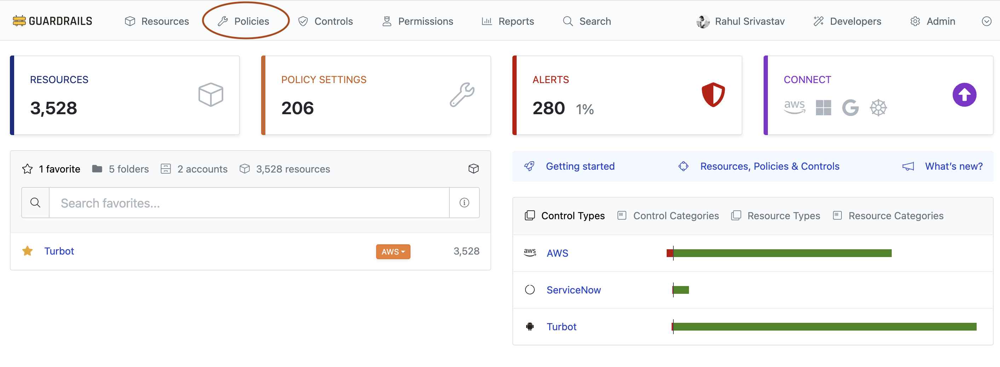
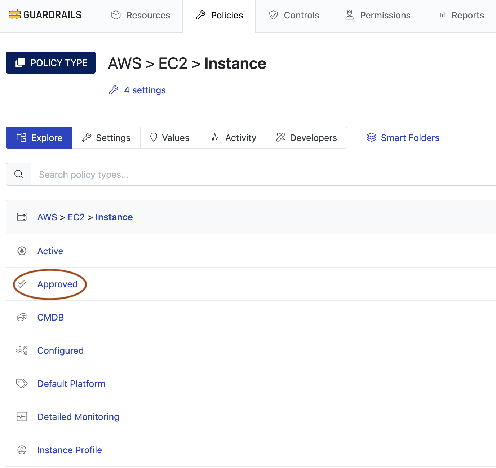
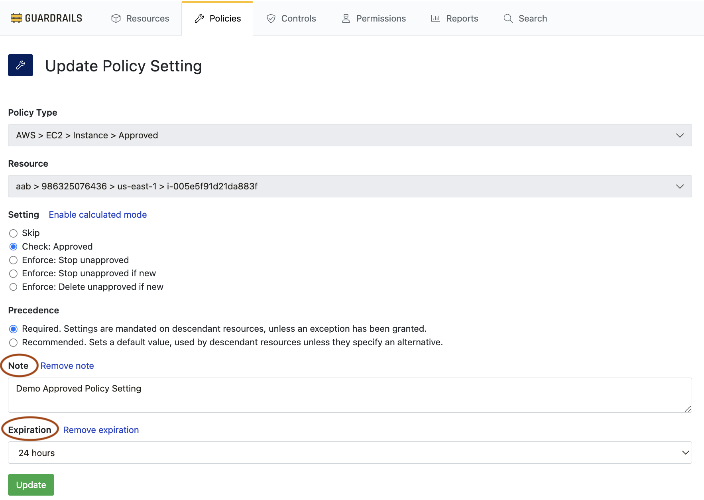
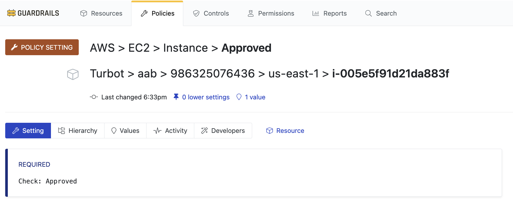

# Runbook: Creating Policy Settings

## Introduction

**Purpose**: This runbook guides administrators through the process of creating policy settings in Guardrails.

**Prerequisites**:
- Access to Guardrails with `Turbot/Admin` permissions.
- Familiarity with the Guardrails Console and Terraform.

---

## Procedure

### Step 1: Access Turbot Console

Log into the Guardrails console, then click the **Policies** tab.



---

### Step 2: Create New Policy Setting

Click the **New Policy Setting** button.


---

### Step 3: Select Policy Type

Select the **Policy Type**, here we select `AWS > EC2 > Instance > Approved`.



---

### Step 4: Select Resource

Select the **Resource** where the policy setting will be applied. The setting will affect all resources at the specified level and below in the [Policy Hierarchy](https://turbot.com/guardrails/docs/concepts/policies/hierarchy).

---

### Step 5: Configure Policy Setting

Select the appropriate setting along with the precedence (Default setting is `Required`). Some policies have predefined settings, while others accept arrays with strings. The right side of the window provides the policy overview, recommendations, and allowed values.


---

### Step 7: Add Note and Expiration (Optional)

If desired, click **Add note** to add change control identifiers such as change order ticket numbers. Click **Add expiration** to set an expiration date.



---

### Step 8: Create Policy Setting

Click **Create** to create your new setting. The policy will immediately go into effect. Be cautious when applying policies capable of changing or removing cloud resources.



---

### Step 9: Create Policy Setting with Terraform

You can manage policy settings with Terraform using the `turbot_policy_setting` resource.

<details>
  <summary>Click to expand code block</summary>

  ```hcl
  # Setting value to "Enforce: Enabled" to enable versioning for buckets
  # AWS > S3 > Bucket > Versioning
  resource "turbot_policy_setting" "s3_bucket_versioning" {
    resource   = turbot_folder.id
    type       = "tmod:@turbot/aws-s3#/policy/types/bucketVersioning"
    value      = "Enforce: Enabled"
  }
  ```
</details>  

// TODO: Add policy edit and calculated policies.

## Troubleshooting

**Common Issues**:

1. **Policy not applied correctly**:
    - **Solution**: Check the policy hierarchy to ensure the policy is set at the correct level.

2. **Incorrect policy values**:
    - **Solution**: Review the policy settings and ensure the values match the allowed formats and recommendations.

---

## Conclusion

**Summary**: You have successfully created a policy setting in Turbot.

**Next Steps**: Monitor the policy for any issues and adjust as necessary. Document any anomalies or changes.
