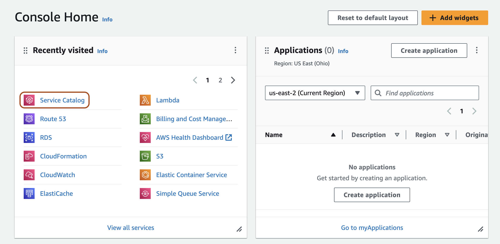
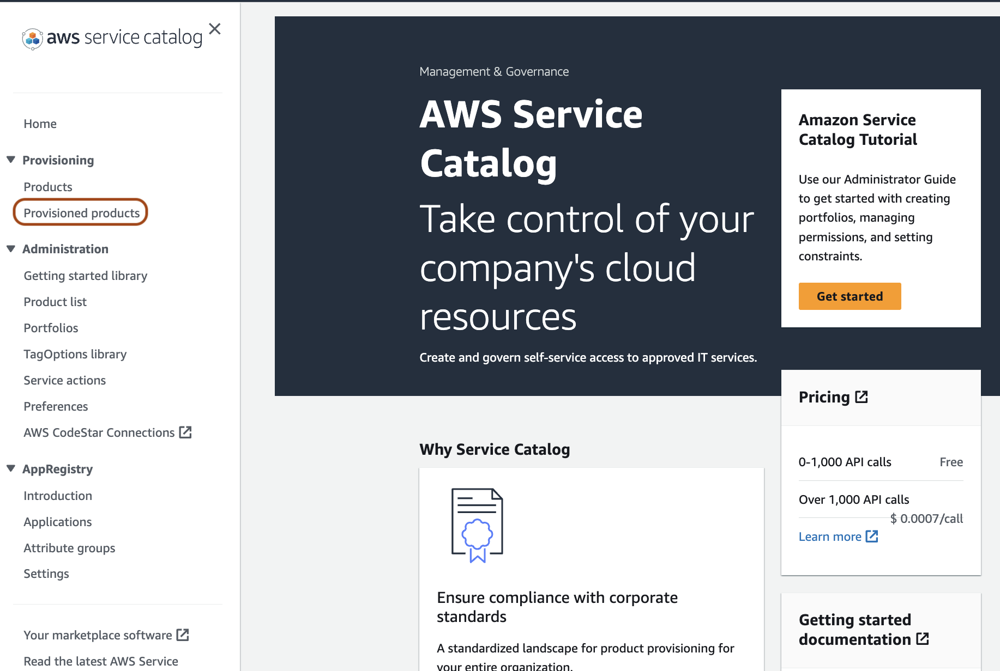
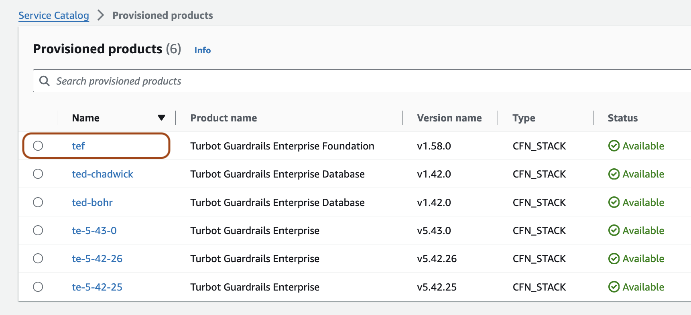
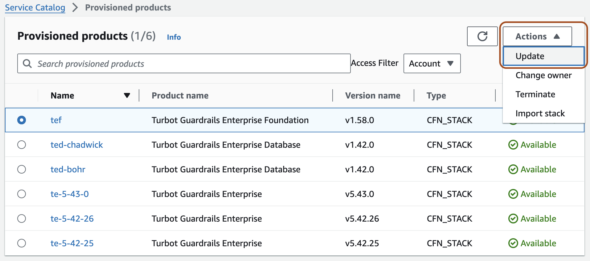
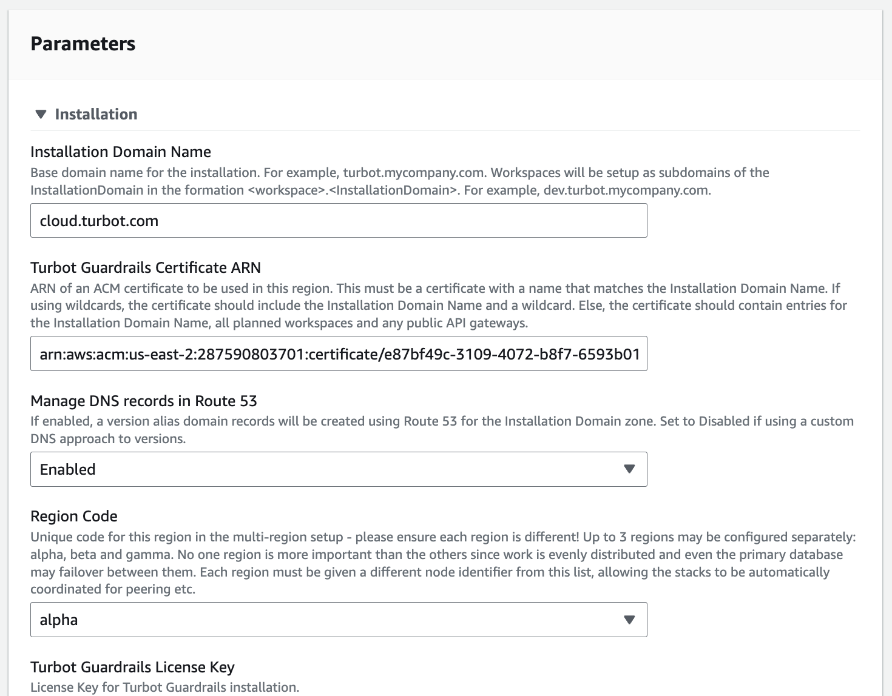
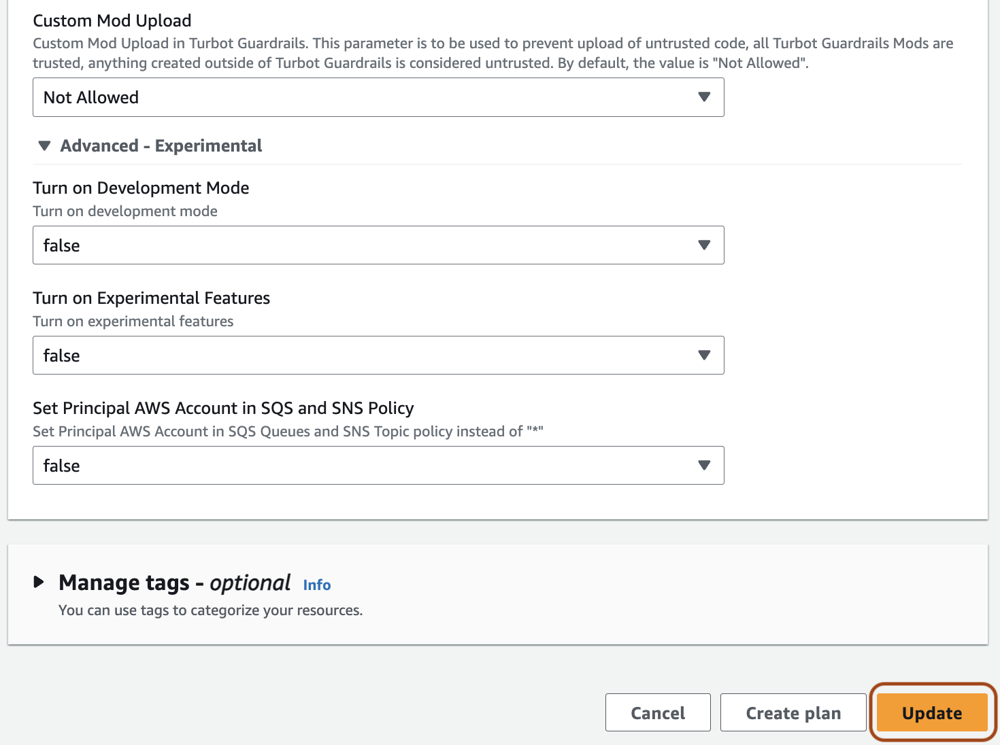
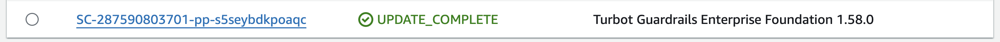

# Runbook: Updating TEF

## Introduction

**Purpose**: This runbook guides administrators through the process of updating TEF.

**Prerequisites**: 
- Access to the Guardrails master account.
- Administrator privileges.
- Familiarity with AWS Console, Service Catalog and Cloud Formation services.

---

## Procedure

### Step 1: Access AWS Console

Open the AWS Console and navigate to the Service Catalog service in the region where the TEF is deployed.

---

### Step 2: Navigate to Provisioned Products

Select the hamburger menu in the top left and click on `Provisioned products`.

---

### Step 3: Identify TEF Product

There should be three or more provisioned products: a TEF product, TED product(s), and TE product(s). If the product names are not clear, select the product to view its details and identify the TEF product.

---

### Step 4: Update TEF Product

Select the TEF product. Click `Actions` and then `Update`.

---

### Step 5: Select Version

Choose the desired version from the `Product versions`.

---

### Step 6: Verify Parameters

Ensure all parameters are correct. Generally, these can be left as default.

---

### Step 7: Confirm Update

Verify the parameters again and select `Update`.

---

### Step 8: Monitor Update

The TEF provisioned product status should change to `Under Change` and the TEF stack in CloudFormation will begin updating. This process typically takes a couple of minutes.

---

## Validation

- The status of the TEF stack in CloudFormation should be `UPDATE_COMPLETE` which ensures the update completed successfully.
- Confirm that the TEF product `Version name` reflects the update and the status moves back to `Available`.

---

## Troubleshooting

**Common Issues**:
1. **The update process takes longer than expected**:
    - Solution: Check the CloudFormation events tab for errors or issues.
2. **Parameters need to be adjusted**:
    - Solution: Review the parameters and consult the product documentation for correct values.

---

## Conclusion

**Summary**: You have successfully updated the TEF Service Catalog product.

**Next Steps**: Monitor the product for any issues post-update and document any anomalies.
