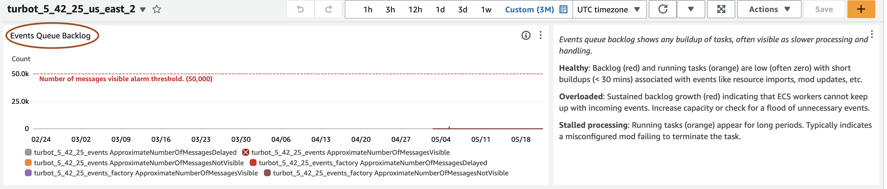
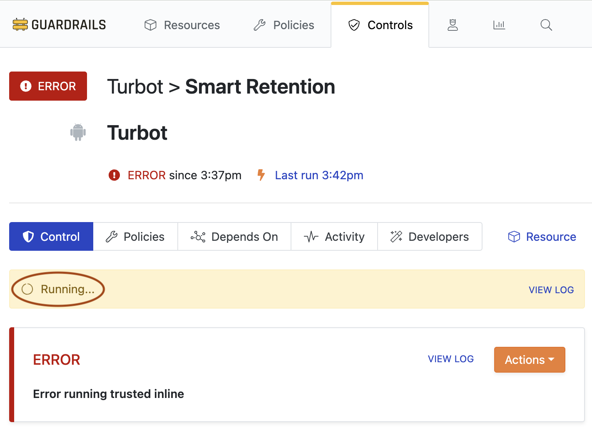
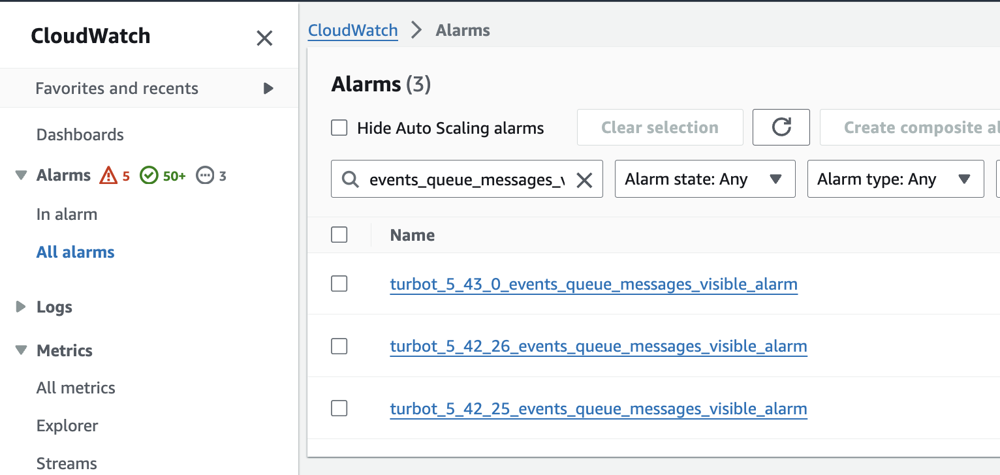
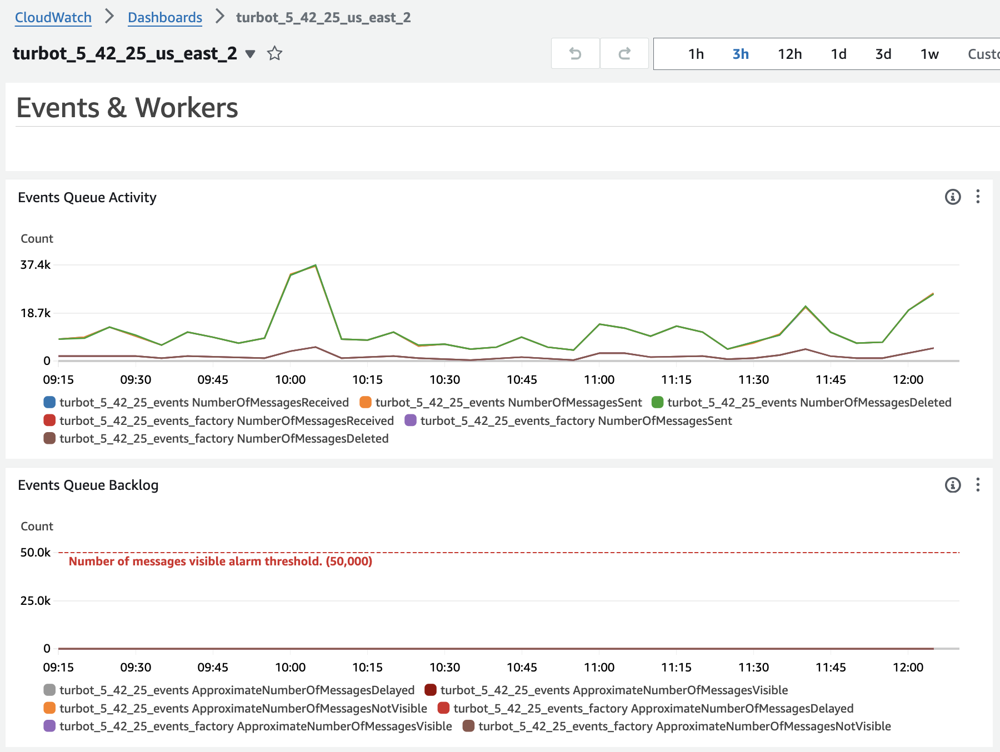
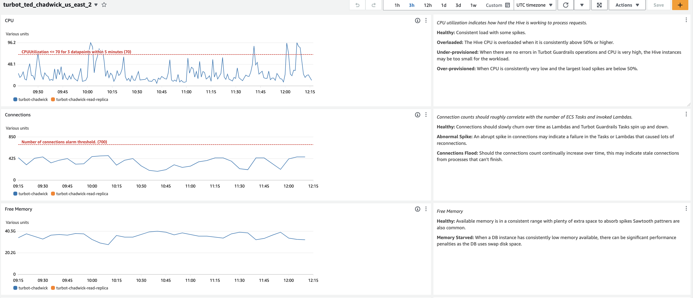
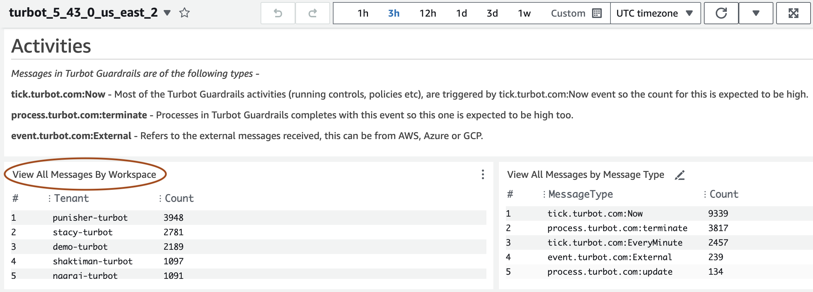
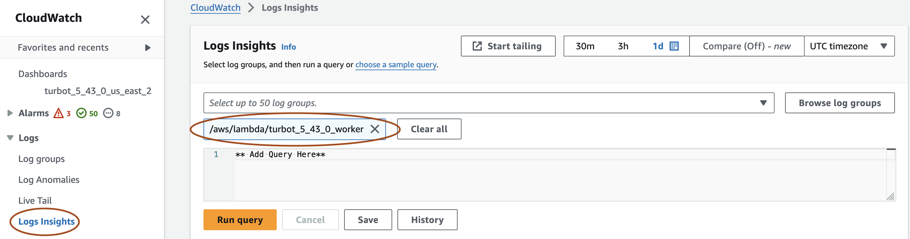
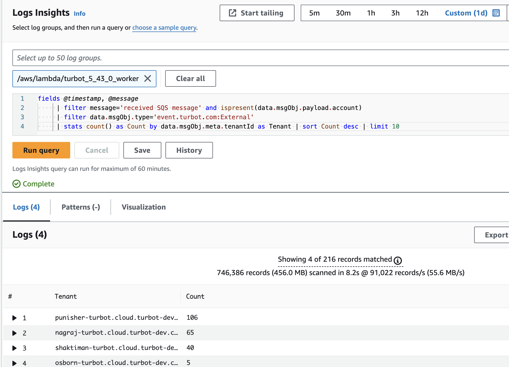

# Runbook: Managing Event Floods

## Introduction

**Purpose**: This runbook guides administrators through the process of identifying, analyzing, and resolving event floods in the Guardrails environment.

**Prerequisites**:
- Access to the Guardrails master account.
- Familiarity with Guardrails Console, CloudWatch, and Guardrails policies.

---

## Procedure

### Step 1: Identify Event Flood

**Check Event Queue Backlog**:
- Check the "Events Queue Backlog" graph in the TE CloudWatch dashboard. A spike or rise would indicate an event flood.

  

**Initial Symptoms**:

**Control Run in the Turbot Console**: 
- Manually run control processes may remain in `Running`, `Initializing` or `Handling` states.

  

**CloudWatch Alarms**:
- Check alarms configured with `turbot_5_{minor}_{patch}_events_queue_messages_visible_alarm` in your cloudwatch.

  

### Step 2: Analyze Common Causes

- **Automation Issues**:
  - Rogue automation scripts or high workloads causing excessive events.

- **Policy Misconfigurations**:
  - Misconfigured policies leading to resource conflicts and continuous creation/deletion cycles.

- **System Misconfigurations**:
  - Undersized databases, low worker concurrency, or insufficient ECS hosts causing processing issues.

### Step 3: Investigate Event Flood

1. **TE CloudWatch Dashboard**:
   - Check the "Events Queue Backlog" and other relevant graphs for spikes indicating an event flood.

   

2. **TED CloudWatch Dashboard**:
   - Review the DB and Elasticache Redis health graphs for any performance issues affecting event processing.

   

3. **Identify and Analyze Noisy Tenant**:

- Use the "View All Messages By Workspace" widget in the TE Dashboard to find the tenant with the highest message count.

   

- Correlate high event activity with the number of accounts/regions in the workspace and compare with the busiest workspaces.

### Step 4: Use CloudWatch Log Insights

Use CloudWatch Insights with these queries to identify accounts and events causing high activity. Compare this activity with the number of accounts/regions and the busiest workspaces.

1. **Navigate to CloudWatch Log Insights**:
   - Select the appropriate TE worker log group and set the duration for the query.

      

2. **Run Queries**:
   - **Top 10 External Messages by Tenant**:
     ```sql
     fields @timestamp, @message
     | filter message='received SQS message' and ispresent(data.msgObj.payload.account)
     | filter data.msgObj.type='event.turbot.com:External'
     | stats count() as Count by data.msgObj.meta.tenantId as Tenant | sort Count desc | limit 10
     ```

      

   - **Top 10 External Messages by Accounts**:
     ```sql
     fields @timestamp, @message
     | filter message='received SQS message' and ispresent(data.msgObj.payload.account) and data.msgObj.meta.tenantId='demo-turbot.cloud.turbot.com'
     | filter data.msgObj.type='event.turbot.com:External'
     | stats count() as Count by data.msgObj.meta.tenantId as Tenant, data.msgObj.payload.account as AccountId
     | sort Count desc | limit 10
     ```

   - **Top 10 External Messages by Source**:
     ```sql
     fields @timestamp, @message
     | filter message='received SQS message' and ispresent(data.msgObj.payload.account) and ispresent(data.msgObj.payload.source) and data.msgObj.meta.tenantId='demo-turbot.cloud.turbot.com'
     | filter data.msgObj.type='event.turbot.com:External'
     | stats count() as Count by data.msgObj.meta.tenantId as Tenant, data.msgObj.payload.source as Source
     | sort Count desc | limit 10
     ```

   - **Top 10 External Messages by Events**:
     ```sql
     fields @timestamp, @message
     | filter message='received SQS message' and ispresent(data.msgObj.payload.account) and ispresent(data.msgObj.payload.source) and data.msgObj.meta.tenantId='demo-turbot.cloud.turbot.com' and data.msgObj.payload.account='123456789012'
     | filter data.msgObj.type='event.turbot.com:External'
     | stats count() as Count by data.msgObj.meta.tenantId as Tenant, data.msgObj.payload.account as AccountId, data.msgObj.payload.source as Source, data.msgObj.meta.eventRaw as EventName
     | sort Count desc | limit 15
     ```

   - **Top 15 External Messages by Source Event**:
     ```sql
     fields @timestamp, @message
     | filter message='received SQS message' and ispresent(data.msgObj.payload.account) and ispresent(data.msgObj.payload.source) and data.msgObj.meta.tenantId='demo-turbot.cloud.turbot.com' and data.msgObj.payload.source='aws.tagging'
     | filter data.msgObj.type='event.turbot.com:External'
     | stats count() as Count by data.msgObj.meta.tenantId as Tenant,  data.msgObj.payload.account as AccountId, data.msgObj.payload.source as Source
     | sort Count desc | limit 15
     ```

### Step 5: Fix Event Flood

1. **Move Noisy Tenant**:
   - Update the noisy tenant to a separate TE version to mitigate performance issues for other workspaces. (// Runbook for updating TE)

2. **Update Event Poller Policy**:
   - Exclude specific events causing the spike using the [AWS > Turbot > Event Poller > Excluded Events](https://turbot.com/v5/mods/turbot/aws/inspect#/policy/types/eventPollerExcludedEvents) policy.

3. **Send Turbot Alert**:
   - Notify the customer and request off-boarding the account or turning off relevant policies(// refer to Turbot Alert Process wiki or create a runbook?).
---

## Validation

- Ensure the `Cloudwatch Event Queue Backlog` returns to normal levels.
- Verify that no new event floods occur and system performance is stable.

---

## Conclusion

**Summary**: Successfully identified, analyzed, and resolved event floods in the Guardrails environment.

**Next Steps**: 

- Monitor the system for any new issues and update runbooks as necessary.

- Check for additional policy misconfigurations or automation conflicts.
