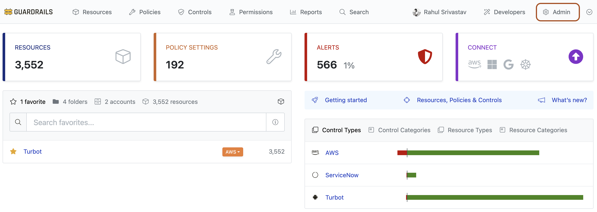
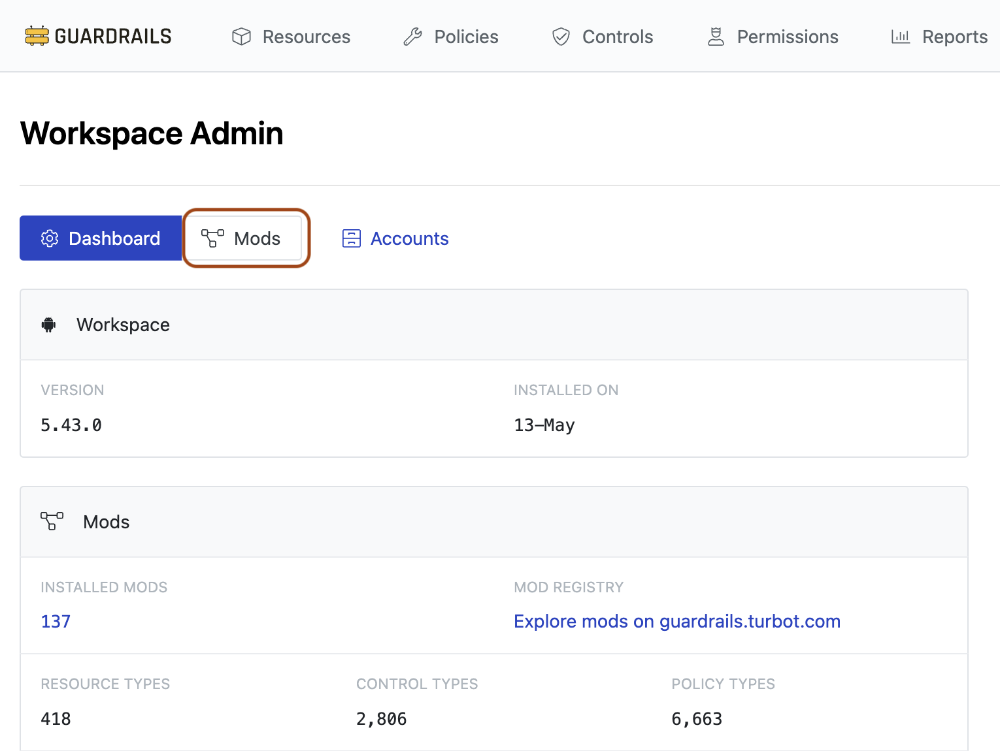
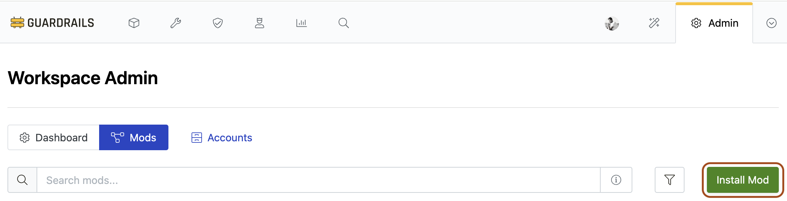
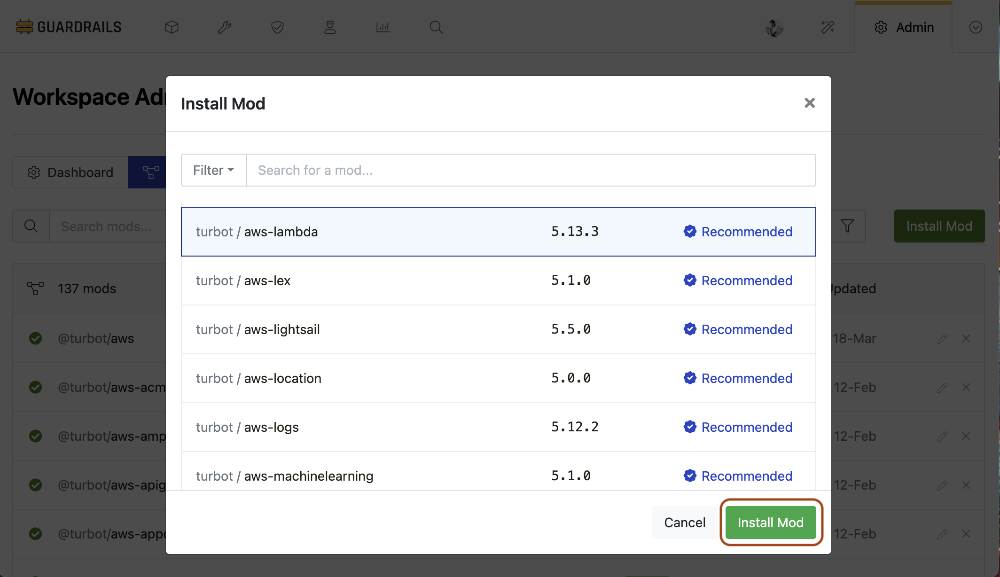
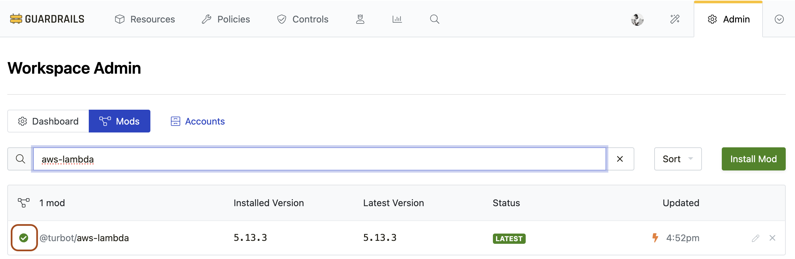
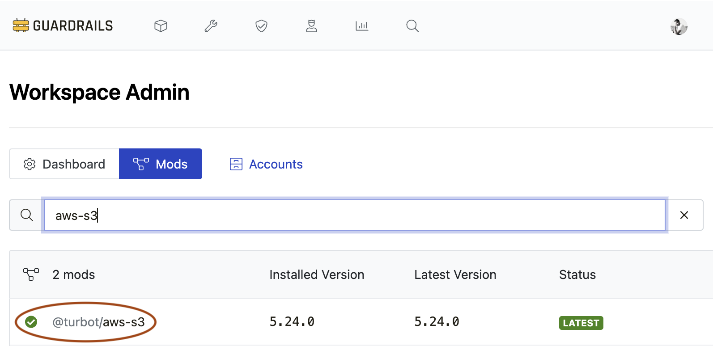

# Runbook: Installing Mods

## Introduction

**Purpose**: This runbook guides administrators through the process of installing mods in the Guardrails environment.

**Prerequisites**: 
- `Turbot/Owner` permissions at Turbot resource level.
- Guardrails CLI [Installed and configured](https://turbot.com/guardrails/docs/reference/cli/installation)
- Terraform with configured [Turbot Guardrails Terraform provider](https://registry.terraform.io/providers/turbot/turbot/latest/docs)
- Familiarity with Guardrails Console, Terraform, and Guardrails CLI.

---

## Procedure

### Install Mod via Guardrails Console

#### Step 1: Access Guardrails Console

Log into the Guardrails console and click the gear icon for the Admin page.



#### Step 2: Navigate to Mods

Click on the `Mods` tab.



#### Step 3: Install Mod

Click `Install Mod`. This launches the Install Mod dialog



Browse or search for the mod, select it, and click `Install Mod`.



#### Step 4: Verify Installation

 The mod will appear in the list and the status icon changes to a green check when installation is complete.

 

## Install Mod via CLI

#### Step 1: Install Mod

Run this command to install the desired mod (e.g., `aws-s3`):

```bash
turbot install @turbot/aws-s3
```
Syntax will be similar across other mod types, such as @turbot/aws-sns, @turbot/gcp, etc.

#### Step 2: Verify Installation

The mod will appear on the Guardrails console installed mods list.



## Install Mod via Terraform

Use the `turbot_mod` resource to install, uninstall, and update mods across an environment.

#### Example Terraform Code

**To use the latest version:**

```hcl
resource "turbot_mod" "aws_s3" {
  parent  = "tmod:@turbot/turbot#/"
  org     = "turbot"
  mod     = "aws-s3"
}
```

Run `terraform plan` to Verify the actions to be performed.

```
Terraform will perform the following actions:

  # turbot_mod.aws-s3 will be created
  + resource "turbot_mod" "aws_s3" {
      + id              = (known after apply)
      + mod             = "aws-s3"
      + org             = "turbot"
      + parent          = "tmod:@turbot/turbot#/"
      + parent_akas     = (known after apply)
      + uri             = (known after apply)
      + version         = "*"
      + version_current = "5.24.0"
      + version_latest  = (known after apply)
    }

Plan: 1 to add, 0 to change, 0 to destroy.
```

Run `terraform apply`

```
turbot_mod.aws-s3: Creating...
turbot_mod.aws-s3: Still creating... [10s elapsed]
turbot_mod.aws-s3: Creation complete after 11s [id=321961374574169]

Apply complete! Resources: 1 added, 0 changed, 0 destroyed.
```

**To install a pinned mod version**

Note: Ensure to set `Turbot > Mod > Auto Update` policy to `Skip` on the Guardrails console when using pinned versions.

```hcl
resource "turbot_mod" "aws_s3" {
  parent  = "tmod:@turbot/turbot#/"
  org     = "turbot"
  mod     = "aws-s3"
  version = "5.5.2"
}
```

**To install mod with dependencies**

The dependent mods should be available prior or installed together.

```hcl
resource "turbot_mod" "aws_s3" {
  parent     = "tmod:@turbot/turbot#/"
  depends_on = [turbot_mod.aws, turbot_mod.aws_iam, turbot_mod.aws_kms]
  org        = "turbot"
  mod        = "aws-s3"
}
```

<details>
<summary>Complete Terraform code with dependencies</summary>

```hcl
resource "turbot_mod" "aws" {
  parent     = "tmod:@turbot/turbot#/"
  org        = "turbot"
  mod        = "aws"
}

resource "turbot_mod" "aws_iam" {
  parent     = "tmod:@turbot/turbot#/"
  org        = "turbot"
  mod        = "aws-iam"
}

resource "turbot_mod" "aws_kms" {
  parent     = "tmod:@turbot/turbot#/"
  org        = "turbot"
  mod        = "aws-kms"
}

resource "turbot_mod" "aws_s3" {
  parent     = "tmod:@turbot/turbot#/"
  depends_on = [
    turbot_mod.aws,
    turbot_mod.aws_iam,
    turbot_mod.aws_kms
  ]
  org        = "turbot"
  mod        = "aws-s3"
} 
```
</details>

## Troubleshooting

**Common Issues**:
1. **Mod installed is in error state**:
    - Solution: Click the mod name to verify its details, including dependent controls, upgrade history, and dependencies.
2. **Terraform installation failed**:
    - Solution: Review the resource type, dependencies and environment config.
3. **Large AWS environments (>100 accounts) accounts for AWS Event Handler churn** 
    -  Solution: Refer to [Mod Installation in Large Environments](https://turbot.com/guardrails/docs/mods/guide/troubleshooting#mod-management-in-large-environments) instructions.

## Conclusion

**Summary**: You have successfully installed a mod.

**Next Steps**: Monitor the mod for any issues post-installation and document any anomalies.